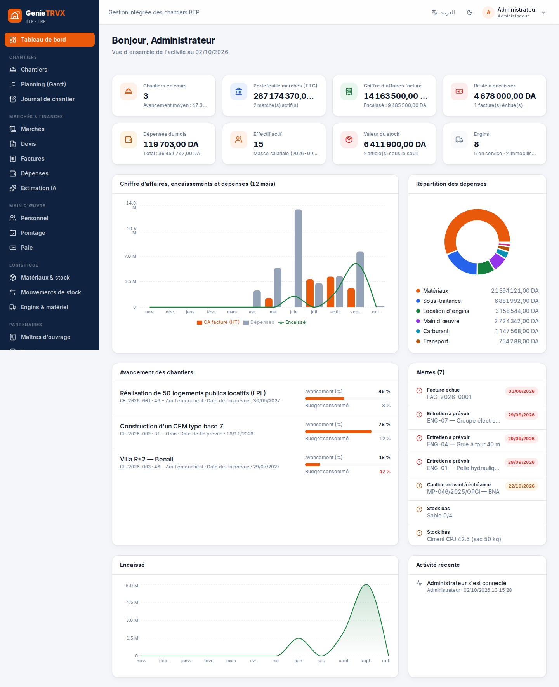
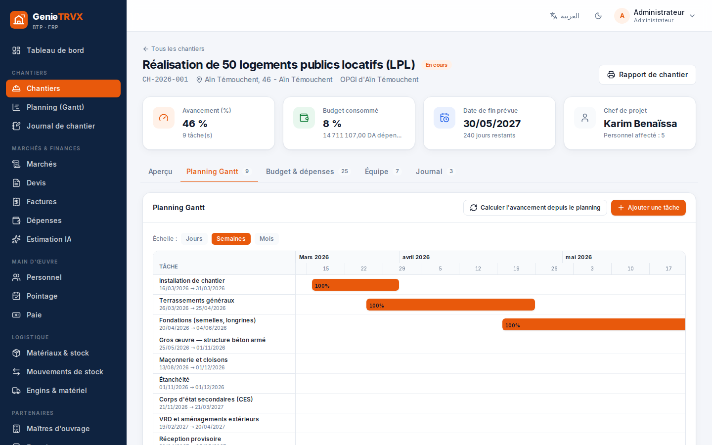
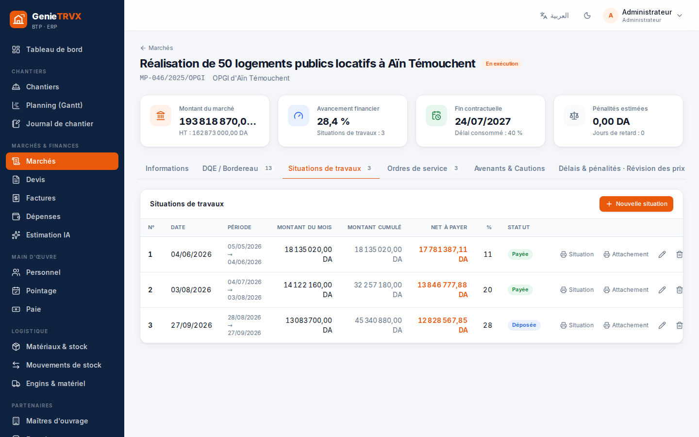
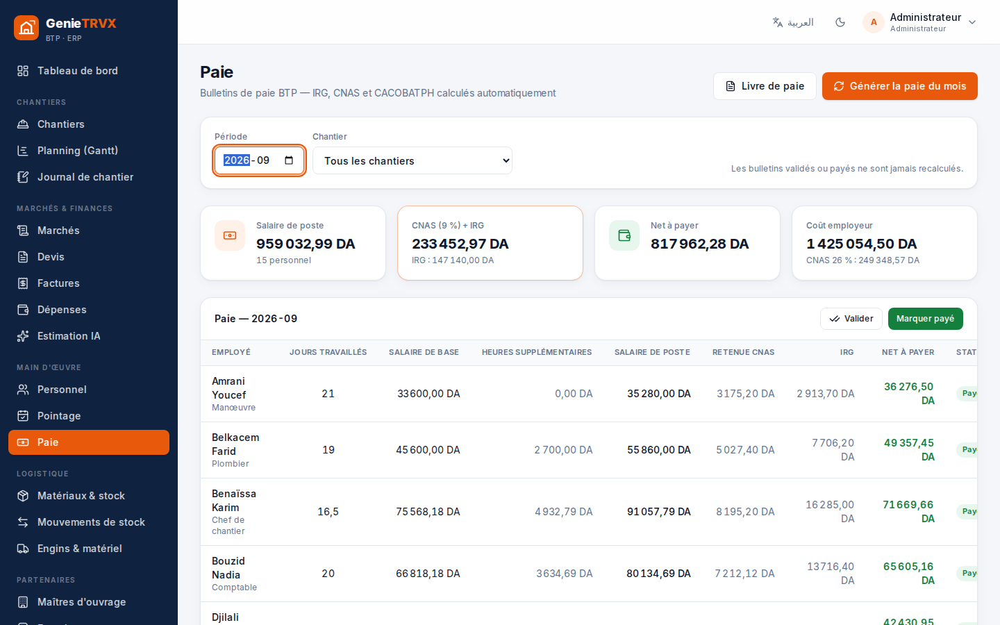
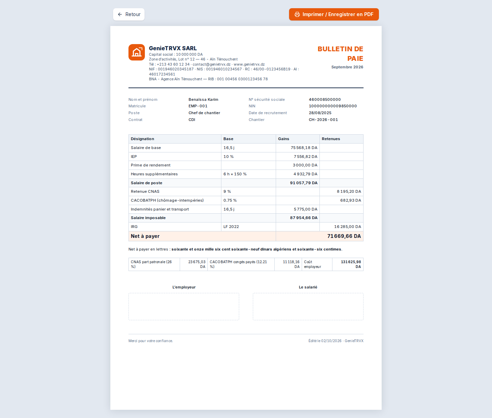
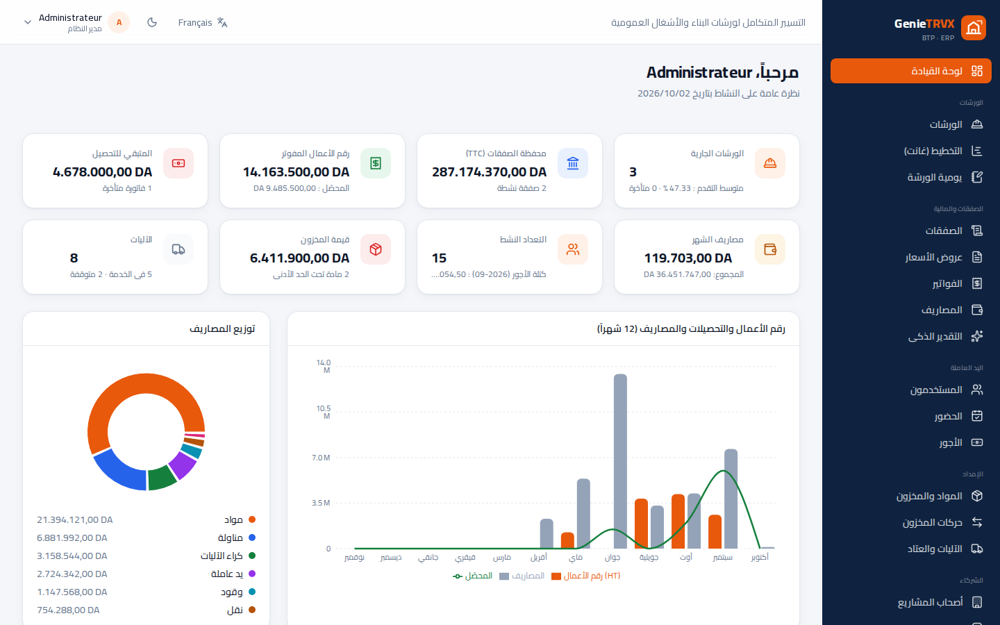

# GenieTRVX — منصة تسيير ورشات البناء والأشغال العمومية

**GenieTRVX** هو نظام تسيير متكامل (ERP) ثنائي اللغة (عربي / فرنسي) لمؤسسات البناء والأشغال العمومية في الجزائر:
الورشات، الصفقات العمومية، الوضعيات المالية، الأجور (IRG / CNAS / CACOBATPH)، الحضور، المخزون، الآليات، الفوترة والتقارير.

> *GenieTRVX est un ERP BTP bilingue français / arabe pour les entreprises algériennes : chantiers, marchés publics, situations de travaux, paie, pointage, stock, engins, facturation et documents PDF.*

---

## الوحدات / Modules

| الوحدة | Module | المحتوى |
|---|---|---|
| لوحة القيادة | Tableau de bord | مؤشرات آنية، رقم الأعمال/التحصيل/المصاريف على 12 شهراً، تقدم الورشات، تنبيهات (فواتير متأخرة، كفالات، مخزون، صيانة، تأمين)، سجل النشاط |
| الورشات | Chantiers | الميزانية والمصاريف، الفريق والآليات، يومية الورشة، **مخطط غانت** تفاعلي وحساب التقدم المرجّح |
| الصفقات | Marchés | الكشف الكمي والتقديري (**استيراد ملف Excel .xlsx أو CSV** أو لصق من Excel)، **وضعيات الأشغال** (اقتطاع الضمان، استرجاع التسبيق، المراجعة، الغرامات)، الكشوف التفصيلية، أوامر الخدمة، الملاحق، الكفالات، الآجال والغرامات، **مراجعة الأسعار** P = P0 × (a + Σ bᵢ·Iᵢ/I0ᵢ) |
| عروض الأسعار والفواتير | Devis & factures | ترقيم تلقائي، TVA، تخفيض، **حقوق الطابع**، التحصيلات، المبلغ بالحروف، تحويل عرض السعر إلى فاتورة |
| التقدير الذكي | Estimation IA | تكلفة المشروع حسب النوع/المستوى/المساحة/الولاية (الشمال، الهضاب، الجنوب)، توزيع الحصص، كميات المواد، المدة والتعداد، إنشاء عرض سعر بنقرة |
| اليد العاملة | Personnel, pointage, paie | ملفات العمال، ورقة الحضور اليومية، **حساب الأجور تلقائياً**: IRG (قانون المالية 2022)، CNAS 9٪ / 26٪، CACOBATPH، الساعات الإضافية، منح القفة والنقل |
| الإمداد | Matériaux, stock, engins | المخزون الحالي والتنبيهات، الدخول/الخروج نحو الورشات (منع الخروج بدون مخزون)، حظيرة الآليات، الصيانة والتأمين |
| الشركاء | Clients, fournisseurs, sous-traitants | 58 ولاية، NIF/NIS/RC/AI، عقود المناولة وتسديداتها |
| التقارير | Rapports & documents | مردودية الورشات و **18 وثيقة PDF** جاهزة للطباعة |
| الإدارة | Utilisateurs & paramètres | 5 أدوار بصلاحيات، إعدادات المؤسسة/الأجور/الفوترة، نسخ احتياطي واسترجاع، سجل النشاط |

### الوثائق القابلة للطباعة (PDF)
عرض السعر · الفاتورة · وضعية الأشغال · الكشف التفصيلي · أمر الخدمة · قسيمة الأجر · دفتر الأجور · بطاقة الحضور الشهرية · تقرير الورشة · يومية الورشة · قائمة المستخدمين · حالة المخزون · سند الدخول/الخروج · قائمة الآليات · حالة المصاريف · ملخص الصفقات · يومية المبيعات · كشف حساب الزبون.

## لقطات الشاشة / Captures d'écran

| | |
|---|---|
|  |  |
| لوحة القيادة — Tableau de bord | مخطط غانت — Planning Gantt |
|  |  |
| وضعيات الأشغال — Situations | الأجور — Paie |
|  |  |
| قسيمة الأجر PDF — Bulletin | الواجهة بالعربية — Interface arabe |

---

## التشغيل السريع / Démarrage rapide

المتطلبات: **Node.js 20.9 أو أحدث** — بدون أي خادم قاعدة بيانات. مع Node 22.13+ تُستعمل قاعدة SQLite المدمجة، ومع Node 20 تُحفظ البيانات تلقائياً في ملف `data/genietrvx.json`.

```bash
cd genietrvx
npm install
npm run dev          # http://localhost:3000
```

عند أول تشغيل تُنشأ القاعدة `data/genietrvx.db` تلقائياً مع بيانات تجريبية.

| الحساب | الدور | كلمة المرور |
|---|---|---|
| admin@genietrvx.dz | مدير النظام | `Demo@2026` |
| direction@genietrvx.dz | المديرية | `Demo@2026` |
| compta@genietrvx.dz | محاسب | `Demo@2026` |
| chef@genietrvx.dz | رئيس ورشة | `Demo@2026` |

> ⚠️ للإنتاج: عرّف `ADMIN_PASSWORD` و`AUTH_SECRET` و`GENIETRVX_DEMO=false` قبل أول تشغيل (انظر `.env.example`).

### الإنتاج / Production

```bash
npm run build
npm start                       # ou : npm run start:standalone
```

أو عبر Docker:

```bash
docker build -t genietrvx .
docker run -d -p 3000:3000 -v genietrvx-data:/app/data \
  -e ADMIN_PASSWORD='MotDePasseFort!' -e GENIETRVX_DEMO=false genietrvx
```

البيانات محفوظة في المجلد `/app/data` (القاعدة + مفتاح الجلسات). استعمل **الإعدادات ← النسخ الاحتياطي** لتحميل نسخة JSON كاملة.

### متغيرات البيئة / Variables d'environnement

| Variable | Défaut | Rôle |
|---|---|---|
| `DATABASE_PATH` | `./data/genietrvx.db` | Fichier SQLite |
| `AUTH_SECRET` | généré dans `data/.auth-secret` | Clé de signature des sessions (≥ 32 caractères) |
| `ADMIN_EMAIL` / `ADMIN_PASSWORD` | `admin@genietrvx.dz` / `Demo@2026` | Compte créé au premier démarrage |
| `GENIETRVX_DEMO` | `true` | `false` = base vide sans données de démonstration |
| `ALLOW_IFRAME` | `false` | `true` (au moment du build) = autoriser l'affichage dans une iframe en production |

> ⚠️ **الاستضافة:** المنصة تحتاج خادماً بقرص دائم (VPS، Docker، Render/Railway مع Volume). على منصات «بدون خادم» مثل Vercel أو Netlify يعمل تسجيل الدخول والتصفح، لكن البيانات الجديدة لا تُحفظ بشكل دائم لأن كل نسخة لها قرص مؤقت خاص بها. عرّف دائماً `AUTH_SECRET` في الإنتاج.

---

## الاختبارات / Tests

```bash
npm run check        # TypeScript + ESLint + tests unitaires (Vitest)
npm run build && npm run test:e2e   # tests de bout en bout (Playwright)
```

- **66 tests unitaires** : IRG/CNAS, bulletins, situations, pénalités, révision des prix, TVA/timbre, montants en lettres, estimation, stock, i18n, base de données, données de démonstration.
- **16 scénarios E2E** : connexion, toutes les pages, CRUD, import Excel/CSV d'un marché, Gantt, situation + PDF, devis → facture → encaissement, pointage → paie, contrôle de stock, estimation, arabe RTL, 18 documents PDF, droits par rôle, affichage mobile.

## البنية التقنية / Architecture

- **Next.js 16** (App Router, `proxy.ts`) · **React 19** · **TypeScript** · **Tailwind CSS 4** · **Recharts**
- API REST (`src/app/api`) validée par **Zod**, sessions JWT (**jose**) en cookie `httpOnly`, mots de passe **bcrypt**, limitation des tentatives de connexion, en-têtes de sécurité
- Stockage documentaire sur **SQLite** natif (`node:sqlite`, Node ≥ 22.13) ou fichier **JSON** automatique (Node 20), avec transactions, intégrité référentielle et journal d'activité
- Logique métier pure et testée dans `src/lib/calc` (paie, marchés, documents, estimation, stock)

```
src/
  app/(app)/        pages de l'application (tableau de bord, chantiers, marchés…)
  app/api/          API REST (données, auth, paie, pointage, statistiques, export, sauvegarde)
  app/print/        documents imprimables / PDF
  components/       interface (CrudPage, Gantt, éditeurs, mise en page)
  lib/calc/         calculs métier (IRG, CNAS, situations, TVA, estimation…)
  lib/server/       base SQLite, authentification, règles métier
  lib/i18n/         dictionnaires français et arabe
```

> ملاحظة: جداول IRG ونسب CNAS / CACOBATPH قابلة للتعديل من **الإعدادات ← الأجور**؛ تحقق منها حسب التنظيم الساري المفعول.
